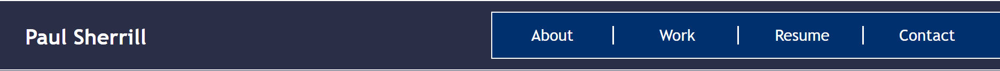
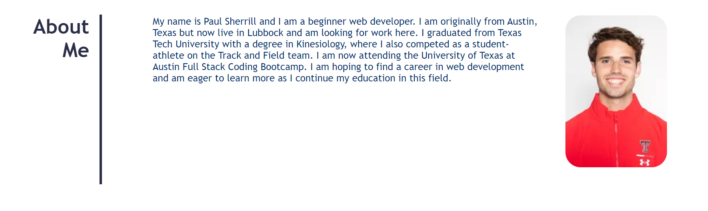
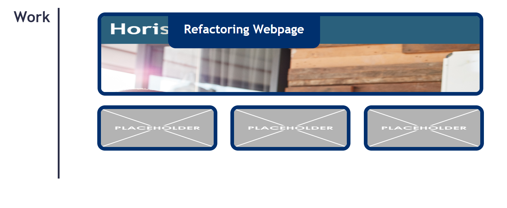
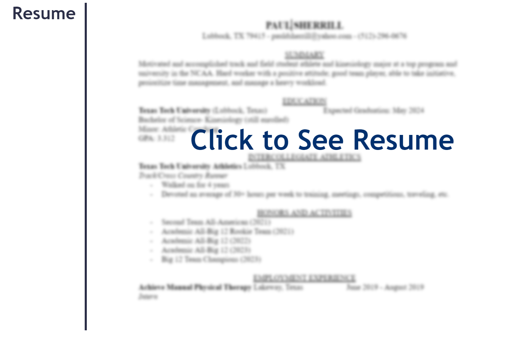

# Professional Portfolio

## Description

In this project I was tasked with creating a professional portfolio from scratch. In this portfolio is information about myself, work that I have completed, my resume, and ways to contact me. 

## Installation

To install my portfolio I began by creating my HTML file and adding the structure and content for my page. For the head I titled the page "Paul Sherrill Portoflio" and added linked a css file for styling and design. For the body, I started with a header that contained my name and a navigation bar that included tags to my About Me, Work, Resume, and Contact Me sections so that viewers could jump straight to whatever section they choose by clicking the tags. I then filled in my content inside each section, including links to images and other websites. In the About Me section I included a short bio about who I am and added a picture of myself to go along with it. In the Work section I added a screenshot of my only completed work, homework-1 and added text to title it "Refactoring Webpage" so that viewers would have a general idea of what I did. I then added three placeholder images to replace with my future projects. In the Resume section, I added a screenshot of my Resume and in the Contact Me section I included links to my email phone number and github account for viewers to contact me.  

My next task was to design this page using a CSS file. By doing this, I was able to adjust my header so that the nav bar was on the top line with my name and the headers all lined up on the left side of the page with their child elements displaying to the right of them. Once all of my elements were sapced and positioned correctly, I then inputted font and coloring to make the page look nice. If any of these changes, altered the spacing, I then changed the spacing so that evrything fit nicely on the page again. After all of this, I finished by using media queries to make sure my page is formatted correctly on all different sizes of screens. 

## Usage

To access and use my webpage visit 

Once you get there, you will see a header with my name and a navigation bar that will take you to different sections of the page.

If you click on the first link, About, it will take you to the About Me section that contains a bio and a photo of me.

If you click on the Work link in the navigation bar it will take you to the work section where all my completed projects are. By clicking on the completed project, it will take you to the corresponding webpage itself.

If you click on the Resume link, it will take you to the Resume section where you will see a blurred image of my resume. Clicking that will take you to a seperate tab where my full resume is.

If you click on the Contact link, it will take you to the Contact Me section. Clicking either the phone number, email, or GitHub link will allow you to contact me through those avenues.

